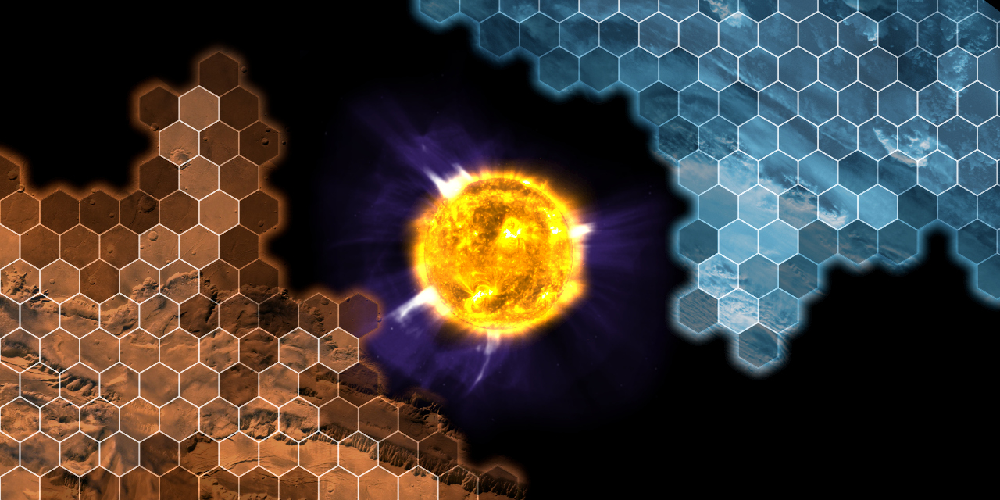
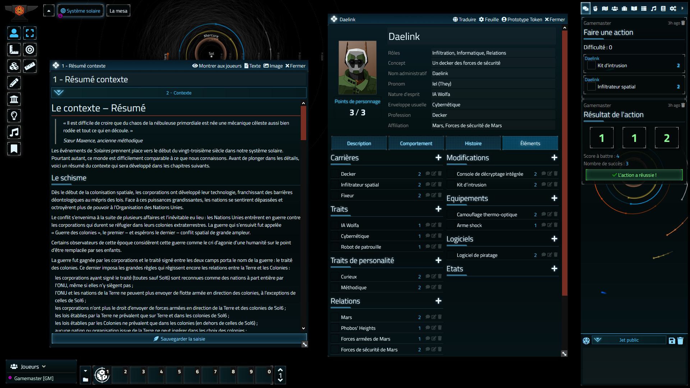

# Solaires-FoundryVTT

Ce système est conçu pour jour à [*Solaires*](https://solaires.feerie.net) avec [*Foundry Virtual Tabletop*](https://foundryvtt.com/).

*Solaires* est un jeu de rôles de science-fiction dont les thèmes explorent le transhumanisme, la colonisation spatiale, l’héroïsme, le progrès technologique et même le paradoxe de Fermi.

Incarnez les Solaires, les enfants de l’humanité, dans un futur technologique où même la mort a rendu sa faux. Prenez part aux intrigues des colonies, véritables cités bâties par les puissantes corporations sur Mercure, Mars et même les lunes de Jupiter et Saturne.

Avec le pouvoir de l’intelligence artificielle, de la fusion nucléaire et des constructeurs universels, contemplez l’univers tels de nouveaux dieux. Et qui sait ? Peut-être parviendrez-vous à vous réconcilier avec ces parents qui vous ont rejetés et vivent reclus sur cette petite planète bleue ?

Mais que vous soyez cyborg, cybernétique, réplicant, chimère, éthéré ou même une IA, n’oubliez jamais que votre si précieuse technologie peut tout aussi bien se retourner contre vous.

## Informations techniques

Lien vers le manifeste du système :
* https://github.com/Greewi/Solaires-FoundryVTT/releases/latest/download/system.json

Prérequis :
* Requiert [*FoundryVTT*](https://foundryvtt.com/)
* Requiert le module [Compendium Folder](https://foundryvtt.com/packages/compendium-folders)

Modules conseillés :
* [Dice so Nice](https://foundryvtt.com/packages/dice-so-nice/) : des dés en 3D, où comment retrouver la joie de voir les dés rouler en temps réel !
* [Monk's Enhanced Journal](https://foundryvtt.com/packages/monks-enhanced-journal) : un navigateur de journaux et notes très très pratique !

## Installation

Via l’instalateur de *Foundry* :
1. Dans le menu `Game Systems` de *Foundry*, cliquez sur `Install System`
2. Entrez `https://github.com/Greewi/Solaires-FoundryVTT/releases/latest/download/system.json` dans Manifest URL
3. Cliquez sur `Install`

Créer et initialiser un monde :
1. Dans le menu `Game Worlds` de *Foundry*, cliquez sur `Create World`
2. Dans `Game System` sélectionnez `Solaires`
3. Remplissez les autres informations à votre convenance et cliquez sur `Create World`
4. Connectez-vous en gamemaster et allez dans l’onglet `Game settings`
5. Allez dans `Manage Modules`
6. Activez le module `Compendium Folder` (ainsi que les autres modules que vous souhaitez utiliser)

Installer les compendiums :
1. Allez dans l’onglet `Compendium Packs`
2. Pour chaque compendium : cliquez sur le compendium puis pour chaque répertoire du compendium, cliquez sur l’icône `Importer la structure des dossiers` (Attendez que l’opération soit finie avant de traiter le dossier suivant)
3. Donnez les droits d’observateur aux joueurs des éléments qui vous intéressent (attention, donner les droits sur un dossier, ne donne pas les droits sur les éléments des sous-dossiers !)
4. Pour le compendium `Actions MJ`, nous vous conseillons de glisser la macro `Débuter une action` dans votre barre de raccourcis

## Résoudre une action

Le système de *Solaires* utilise une méthode de résolution des actions un peu particulière. Si vous avez importé les compendiums, vous trouverez les règles du jeu dans le dossier `1 – Règles`.

Pour résoudre une action (une fois que le meneur et le joueur se sont mis d’accord sur l’action) :
* Commencez par cliquer sur la macro `Débuter une action`
* Dans la fenêtre, sélectionnez les difficultés que vous souhaitez puis cliquez sur `Commencer l’action`
* Dans le chat, un bloc contenant les informations de l’action en cours.
* Le (ou les) joueurs doivent sélectionner les éléments à utiliser en cliquant sur ceux-ci dans leur fiche de personnage (il n’est pas possible de les drag&drop)
* Une fois les éléments choisis et validés par le MJ (le bouton MJ sert à indiquer l’approbation du MJ, mais il n’empèche pas de lancer les dés), le joueur peut cliquer sur lancer les dés et l’action sera résolue.

## Screenshots

## Remerciements et contributions

* JDW qui est à la base de ce système pour *Foundry VTT*
* Mes innombrables cobayes qui ont écopés les bugs

## Licences

* Le code du module est distribué sous la licence [GPL-3](https://www.gnu.org/licenses/gpl-3.0.en.html)
* Le contenu des compendiums est distribué sous la licence [Creative Commons CC BY-NC-SA 4.0](https://creativecommons.org/licenses/by-nc-sa/4.0/)
